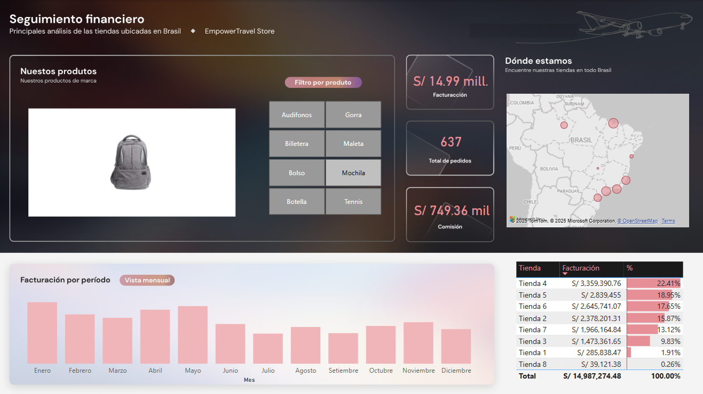

# 💰 Dashboard de Seguimiento Financiero

## 📢 Descripción
Este **Dashboard de Seguimiento Financiero** ha sido diseñado para proporcionar una visión clara y detallada sobre el rendimiento de ventas y facturación de las tiendas ubicadas en Brasil. Permite a los usuarios analizar datos clave para la toma de decisiones estratégicas y optimización del negocio.

## 🎯 Funcionalidades
- 📊 **Visualización de facturación total y comisiones**
- 🛍️ **Análisis de pedidos y ventas por producto**
- 📍 **Ubicación de tiendas y distribución geográfica de ventas**
- 📅 **Facturación por período (mensual y anual)**
- 📌 **Ranking de tiendas según facturación**

## **Archivo Power BI**  
El archivo de Power BI con el análisis se encuentra en la carpeta [powerbi](powerbi/).

